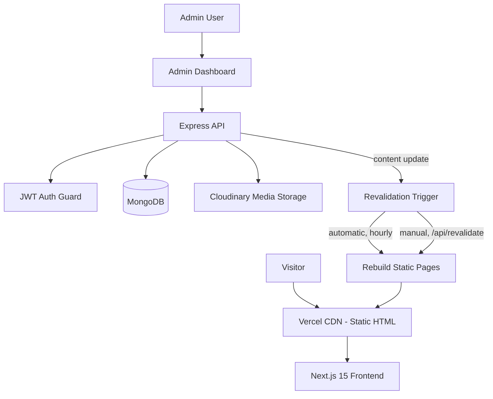

<div align="center">


<br/>

[](LICENSE)
[](https://nextjs.org/)
[](https://react.dev/)
[](https://www.typescriptlang.org/)
[](https://expressjs.com/)
[](https://mongodb.com/)


<br/>

<a href="#-overview"></a>
<a href="#-key-features"></a>
<a href="#%EF%B8%8F-technology-stack"></a>
<a href="#-system-architecture"></a>
<a href="#%EF%B8%8F-installation--setup"></a>
<a href="#-deployment"></a>

<br/><br/>


</div>

<br/>

## 📌 Overview

> **Portfolio** is a modern AI/ML Engineer portfolio built to showcase my technical expertise, featured projects, and professional journey. It combines a premium user experience with responsive design, smooth animations, and performance-focused architecture to create a polished digital presence.
>
> The portfolio highlights my work across **Machine Learning, Generative AI, Large Language Models (LLMs), AI Agents, Computer Vision, FastAPI, and Data Science**, while providing recruiters and developers with an intuitive way to explore my projects, skills, and experience.

<div align="center">

| | |
|:---:|:---|
| 🚀 | **Premium Design** — Modern UI with responsive layouts, smooth animations, and clean typography |
| 🤖 | **AI Engineering** — Showcasing intelligent applications, AI-powered solutions, and production-focused projects |
| 📂 | **Project Showcase** — Highlighting featured work with live demos, GitHub repositories, and technical details |
| ⚡ | **Performance & SEO** — Optimized for speed, accessibility, responsiveness, and search engine visibility |

</div>


## 🚀 Key Features

<table>
<tr>
<td width="50%" valign="top">

### 🎨 Creative UI/UX
WebGL mosaic shader hero animations, buttery Framer Motion transitions, an interactive limelight nav bar, and a custom cursor — with full dark/light mode theming.

### 🏎️ ISR-Powered Performance
Every public page is statically generated at build time and revalidated hourly, so visitors never wait on a backend cold start.

</td>
<td width="50%" valign="top">

### 📊 Admin Dashboard
A dedicated CMS for hero copy, about section, skills, experience timeline, projects (with image uploads), blogs, and certificates — all reflected on the live site via ISR.

### 🛡️ Security-First Backend
API fully proxied and hidden behind Next.js, with XSS-sanitized inputs, rate limiting, Zod schema validation, and Helmet security headers.

</td>
</tr>
</table>


## 🛠️ Technology Stack

<div align="center">


</div>

| Layer | Technology | Details |
|:--|:--|:--|
| **Frontend** | Next.js 15, React 18, TypeScript | App Router, ISR-driven static rendering |
| **Styling & Motion** | Tailwind CSS, Framer Motion | Utility-first styling, smooth page/element transitions |
| **Backend** | Node.js, Express | REST API, proxied through Next.js and never exposed directly |
| **Database** | MongoDB | Document store for projects, blogs, certificates, experience, messages |
| **Media** | Cloudinary | Image uploads and optimized delivery for admin-managed content |
| **Validation & Security** | Zod, Helmet, rate limiting | Type-safe schemas and hardened API surface |
| **Auth** | JWT | Token-based admin authentication |
| **Deployment** | Vercel (frontend), Render (backend) | Static CDN hosting + always-on API service |


## 📐 System Architecture




## 📂 Folder Structure

```
Portfolio/
├── client/                  # Next.js Frontend
│   ├── app/                 # App Router pages
│   │   ├── admin/           # Admin dashboard
│   │   ├── blog/            # Blog pages
│   │   └── api/             # API routes (revalidation)
│   ├── components/          # React components
│   ├── lib/
│   │   └── data.ts          # ISR data fetching layer
│   └── public/               # Static assets
│
├── server/                   # Express Backend
│   ├── src/
│   │   ├── controllers/      # Route handlers
│   │   ├── models/           # Mongoose schemas
│   │   ├── router/           # API routes
│   │   └── middleware/       # Auth, validation, etc.
│   └── scripts/
│       └── create_admin.js   # Admin user creation
│
├── certificates/              # Certificate assets
├── Dipak_Khandagale_Resume.pdf
├── netlify.toml
├── LICENSE
└── README.md
```


## 📸 Screenshots

| Feature | Preview |
|:--|:--:|
| Hero (WebGL Shader) | *coming soon* |
| Projects Grid | *coming soon* |
| Admin Dashboard | *coming soon* |
| Blog | *coming soon* |


## ⚙️ Installation & Setup

<details open>
<summary><b>Prerequisites</b></summary>
<br/>

- Node.js 18+
- MongoDB Atlas account
- Cloudinary account (for media)

</details>

<details open>
<summary><b>1. Clone the repository</b></summary>
<br/>

```bash
git clone https://github.com/Dipakk7/Portfolio.git
cd Portfolio
```

</details>

<details>
<summary><b>2. Install dependencies</b></summary>
<br/>

```bash
npm install          # Root package.json
cd client && npm install
cd ../server && npm install
```

</details>

<details>
<summary><b>3. Client environment</b></summary>
<br/>

Create `client/.env.local`:

```env
# Server-side only (for ISR data fetching)
API_URL=http://localhost:5000

# Optional: On-demand revalidation
REVALIDATE_SECRET=your-super-secret-key
```

</details>

<details>
<summary><b>4. Server environment</b></summary>
<br/>

Create `server/.env`:

```env
PORT=5000
NODE_ENV=development

# Database
MONGODB_URI=mongodb+srv://...

# Authentication
JWT_SECRET=your-jwt-secret

# Cloudinary
CLOUDINARY_CLOUD_NAME=your-cloud
CLOUDINARY_API_KEY=your-key
CLOUDINARY_API_SECRET=your-secret
```

</details>

<details open>
<summary><b>5. Run locally</b></summary>
<br/>

**Backend:**

```bash
cd server
npm run dev
# → http://localhost:5000
```

**Frontend:**

```bash
cd client
npm run dev
# → http://localhost:3000
```

</details>


## 🌐 Deployment

<table>
<tr>
<td width="50%" valign="top">

### Frontend (Vercel)
1. Import the `client` folder to Vercel
2. Set `API_URL` and `REVALIDATE_SECRET`
3. Deploy 🚀

</td>
<td width="50%" valign="top">

### Backend (Render)
1. Create a new Web Service from the `server` folder
2. Set all backend environment variables
3. Deploy 🚀

</td>
</tr>
</table>

**On-demand revalidation** — after updating content in admin, trigger an instant cache refresh:

```bash
curl "https://your-site.vercel.app/api/revalidate?secret=YOUR_SECRET"
```


## 📄 License

Distributed under the MIT License. See [LICENSE](LICENSE) for details.

<br/>

<div align="center">

## 👨‍💻 Connect With Me

[](https://github.com/Dipakk7)
[](https://www.linkedin.com/in/dipakkhandagale/)
[](https://dipakkhandagale.vercel.app/)

<br/>

### ⭐ If you find this useful, consider starring the repo!

[](https://github.com/Dipakk7/Portfolio/stargazers)

<br/><br/>

<a href="#portfolio">
  
</a>


</div>
