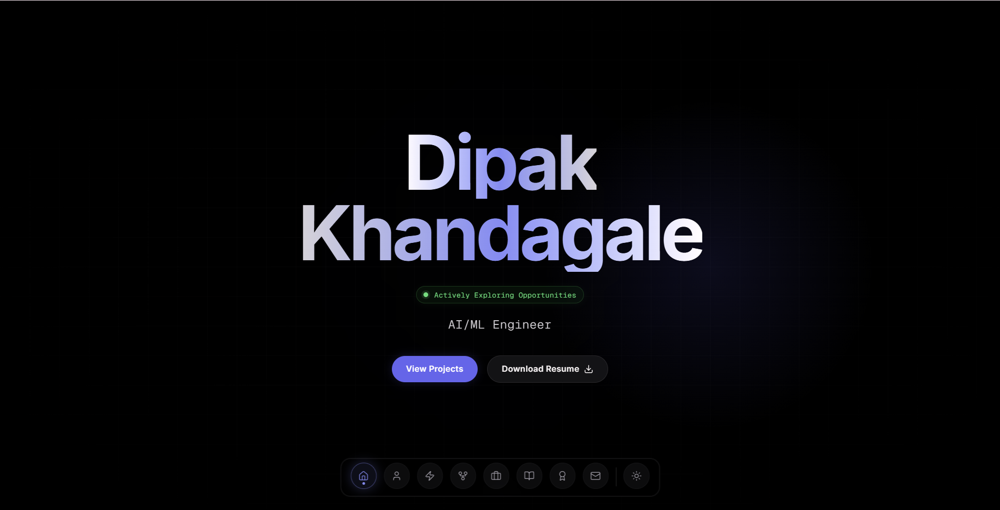
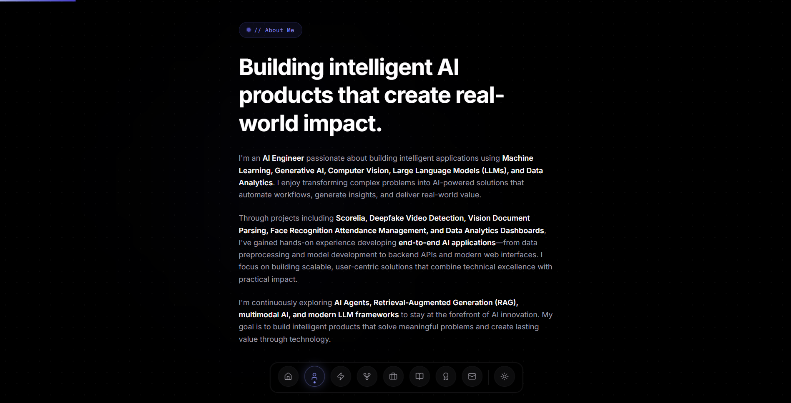
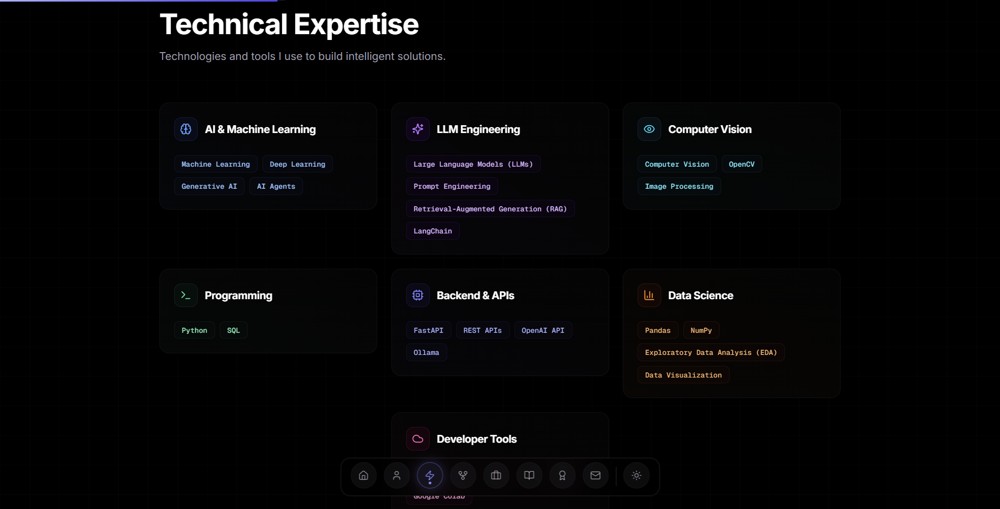
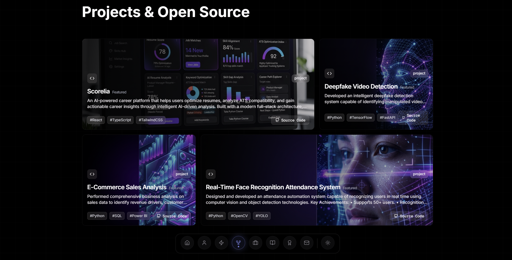
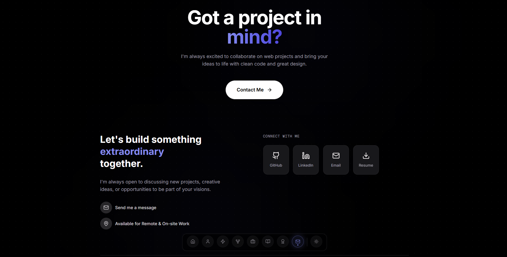

<div align="center">


<br/>

[](LICENSE)
[](https://nextjs.org/)
[](https://react.dev/)
[](https://www.typescriptlang.org/)
[](https://tailwindcss.com/)
[](https://www.framer.com/motion/)
[](https://vercel.com/)


<br/>

<a href="#-overview"></a>
<a href="#-features"></a>
<a href="#️-technology-stack"></a>
<a href="#-featured-projects"></a>
<a href="#-screenshots"></a>
<a href="#-installation"></a>
<a href="#-project-structure"></a>
<a href="#-deployment"></a>
<a href="#-contact"></a>

<br/><br/>

</div>

<br/>

## 📌 Overview

> This repository powers my personal **AI/ML Engineer portfolio** — a modern, responsive site built to showcase my projects, technical skills, and professional journey in a clean, recruiter-friendly experience.
>
> It's designed around performance and clarity: fast page loads, smooth animations, and a focused presentation of the work I've built across **Machine Learning, Generative AI, LLMs, and AI Agents**.


## ✨ Features

<div align="center">

| | | |
|:---:|:---:|:---:|
| 🎨 **Modern Premium UI** | 📱 **Fully Responsive** | 🎬 **Smooth Animations** |
| 🤖 **AI Project Showcase** | 🧠 **Technical Skills Section** | 📄 **Resume Download** |
| 🌗 **Dark & Light Mode** | 🔍 **SEO Optimized** | ⚡ **Fast Performance** |

</div>


## 🛠️ Technology Stack

<div align="center">

**Frontend**


**AI / ML Skills Showcased**


**Tools**


</div>

<div align="center">

| Category | Stack |
|:--|:--|
| **Frontend** | Next.js, React, TypeScript, Tailwind CSS, Framer Motion |
| **AI Skills Showcased** | Python, Machine Learning, FastAPI, LLMs |
| **Tools & Deployment** | Git, GitHub, Vercel |

</div>


## 🛠️ Featured Projects

<table>
<tr>
<td width="50%" valign="top">

**[🧭 Scorelia](https://github.com/Dipakk7/Scorelia)** — *Flagship Project*

AI-powered career intelligence platform featuring resume parsing, ATS scoring, semantic job matching, a multi-agent AI system, and a local RAG-based career assistant — built with FastAPI, React, and PostgreSQL.

`Python` `FastAPI` `React` `PostgreSQL` `Ollama` `RAG`

</td>
<td width="50%" valign="top">

**[🎭 Deepfake Video Detection](https://github.com/Dipakk7/DeepfakeDetect)**

Deepfake video detection using ResNet50 and BiLSTM for temporal feature learning.

`PyTorch` `Computer Vision` `Deep Learning`

</td>
</tr>
<tr>
<td width="50%" valign="top">

**[🎥 Face Recognition Attendance System](https://github.com/Dipakk7/Face_reco_attendance_management)**

Real-time attendance system using OpenCV and face recognition for automated classroom attendance.

`OpenCV` `Python` `Computer Vision`

</td>
<td width="50%" valign="top">

**[📊 Sales Analytics Dashboard](https://github.com/Dipakk7/Ecommerce-Sales-Analysis)**

Interactive Power BI dashboard analyzing sales trends, KPIs, and customer insights using SQL.

`Power BI` `SQL` `Data Analytics`

</td>
</tr>
</table>


## 🌐 Live Demo

<div align="center">

**🌐 Live Website:** [dipakkhandagale.vercel.app](https://dipakkhandagale.vercel.app)

[](https://dipakkhandagale.vercel.app)

</div>


## 📸 Screenshots

<div align="center">



*Hero Section*

<br/><br/>



*About Section*

<br/><br/>



*Skills Section*

<br/><br/>



*Projects Section*

<br/><br/>



*Contact Section*

</div>


## ⚙️ Installation

```bash
# Clone the repository
git clone https://github.com/Dipakk7/Portfolio.git
cd Portfolio

# Install dependencies
npm install

# Run the development server
npm run dev

# Build for production
npm run build
```


## 📂 Project Structure

```
Portfolio/
├── app/                 # Pages and routes
├── components/          # Reusable UI components
├── public/               # Static assets & screenshots
├── styles/               # Global styles
├── LICENSE
└── README.md
```


## 🚢 Deployment

Hosted on **Vercel**, with automatic deployment triggered on every push to the `main` branch.


## 📄 License

Distributed under the MIT License. See [LICENSE](LICENSE) for details.

<br/>

<div align="center">

## 📬 Contact

[](https://github.com/Dipakk7)
[](https://www.linkedin.com/in/dipakkhandagale/)
[](https://dipakkhandagale.vercel.app/)
[](mailto:khandagaledipak47@gmail.com)

<br/>

### ⭐ If you like this project, please consider starring the repository!

[](https://github.com/Dipakk7/Portfolio/stargazers)

<br/><br/>

<a href="#dipak-khandagale">
  
</a>


</div>
