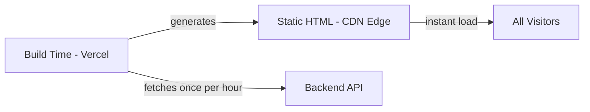

<div align="center">

# 🚀 Personal Portfolio

### A blazing-fast, visually stunning portfolio with ISR-powered static architecture

[](https://nextjs.org/)
[](https://react.dev/)
[](https://typescriptlang.org/)
[](https://tailwindcss.com/)
[](https://mongodb.com/)
[](LICENSE)

**[🌐 Live Demo](http://dipakkhandagale.vercel.app/)** · **[📖 Documentation](#-getting-started)** · **[🐛 Report Bug](https://github.com/Dipakk7/Portfolio/issues)**

</div>

---

## 📸 Preview

<div align="center">

<!-- Replace with actual screenshots or a demo GIF -->


*Hero section with WebGL mosaic shaders and live theme switching*

</div>

> 💡 **Tip:** Add 2–3 screenshots (hero, projects grid, admin dashboard) or a short screen-recording GIF here. This is the single highest-impact addition for a portfolio repo — recruiters skim, they don't clone.

---

## 📑 Table of Contents

- [Performance First](#-performance-first)
- [Features](#-features)
- [Admin Content Management](#-admin-content-management)
- [Tech Stack](#️-tech-stack)
- [Getting Started](#-getting-started)
- [Deployment](#-deployment)
- [Project Structure](#-project-structure)
- [ISR Data Flow](#-isr-data-flow)
- [Roadmap](#-roadmap)
- [License](#-license)
- [Contact](#-contact)

---

## ⚡ Performance First

Built with **Incremental Static Regeneration (ISR)**, the site loads **instantly** from Vercel's CDN. Backend cold starts don't affect your visitors.

| Metric                  | Value    |
| ------------------------ | -------- |
| First Contentful Paint   | < 1s     |
| Time to Interactive      | < 2s     |
| Runtime API Calls        | **0**    |

### 🔄 How It Works



---

## ✨ Features

<table>
<tr>
<td valign="top" width="33%">

### 🎨 Creative UI/UX
- **WebGL Mosaic Shaders** — pixelated wave hero animations
- **Framer Motion** — buttery smooth transitions
- **Limelight Navigation** — interactive spotlight nav bar
- **Custom Cursor** — unique browsing experience
- **Dark/Light Mode** — system-aware theming

</td>
<td valign="top" width="33%">

### 🛡️ Security
- **Hidden Backend** — API proxied via Next.js
- **XSS Protected** — sanitized inputs
- **Rate Limited** — abuse prevention
- **Zod Validation** — type-safe schemas
- **Helmet Headers** — security-first

</td>
<td valign="top" width="33%">

### 📊 Admin Dashboard
- **Home Content** — Hero, About, Skills, Footer
- **Projects** — CRUD with image uploads
- **Blogs** — rich content management
- **Certificates** — showcase credentials
- **Experience** — timeline management
- **Messages** — contact form inbox

</td>
</tr>
</table>

---

## 📝 Admin Content Management

All content is managed through the admin dashboard and reflected on the site via ISR:

| Admin Section    | Controls                                                          |
| ----------------- | ------------------------------------------------------------------ |
| **Home Content**  | Hero title/subtitle, About section, Skills, Social links, Footer  |
| **Experience**    | Work history timeline with roles, companies, descriptions          |
| **Projects**      | Portfolio projects with images, GitHub links, tech tags            |
| **Blogs**         | Blog posts with rich content and tags                              |
| **Certificates**  | Professional certifications with images                            |
| **Skills**        | Technology icons displayed in a staggered grid                     |

---

## 🛠️ Tech Stack

<div align="center">


</div>

---

## 🚀 Getting Started

### Prerequisites

- Node.js 18+
- MongoDB Atlas account
- Cloudinary account (for media)

### Installation

```bash
# Clone the repository
git clone https://github.com/Dipakk7/Portfolio.git
cd Portfolio

# Install all dependencies
npm install          # Root package.json
cd client && npm install
cd ../server && npm install
```

### Environment Setup

**📁 Client Environment (`client/.env.local`)**

```env
# Server-side only (for ISR data fetching)
API_URL=http://localhost:5000

# Optional: On-demand revalidation
REVALIDATE_SECRET=your-super-secret-key
```

**📁 Server Environment (`server/.env`)**

```env
PORT=5000
NODE_ENV=development

# Database
MONGODB_URI=mongodb+srv://...

# Authentication
JWT_SECRET=your-jwt-secret

# Cloudinary
CLOUDINARY_CLOUD_NAME=your-cloud
CLOUDINARY_API_KEY=your-key
CLOUDINARY_API_SECRET=your-secret
```

### Run Locally

```bash
# Terminal 1 - Start Backend
cd server
npm run dev
# → http://localhost:5000

# Terminal 2 - Start Frontend
cd client
npm run dev
# → http://localhost:3000
```

---

## 🌐 Deployment

### Frontend (Vercel)

1. Import the `client` folder to Vercel
2. Set environment variables:
   ```env
   API_URL=https://your-backend.onrender.com
   REVALIDATE_SECRET=<your-secret>
   ```
3. Deploy 🚀

### Backend (Render)

1. Create a new Web Service from the `server` folder
2. Set all backend environment variables
3. Deploy 🚀

### On-Demand Revalidation

After updating content in admin, trigger an instant cache refresh:

```bash
curl "https://your-site.vercel.app/api/revalidate?secret=YOUR_SECRET"
```

Or add a "Publish Changes" button in the admin dashboard.

---

## 📁 Project Structure

```
Portfolio/
├── client/                 # Next.js Frontend
│   ├── app/                # App Router pages
│   │   ├── admin/          # Admin dashboard
│   │   ├── blog/           # Blog pages
│   │   └── api/            # API routes (revalidation)
│   ├── components/         # React components
│   ├── lib/
│   │   └── data.ts         # ISR data fetching layer
│   └── public/              # Static assets
│
├── server/                  # Express Backend
│   ├── src/
│   │   ├── controllers/     # Route handlers
│   │   ├── models/          # Mongoose schemas
│   │   ├── router/          # API routes
│   │   └── middleware/      # Auth, validation, etc.
│   └── scripts/
│       └── create_admin.js  # Admin user creation
│
└── README.md
```

---

## 🔄 ISR Data Flow

All public pages are **statically generated** at build time:

```mermaid
flowchart LR
    A[Admin Updates Content] --> B[Backend API]
    B --> C{Revalidation Trigger}
    C -->|Automatic| D[Every 1 Hour]
    C -->|Manual| E[/api/revalidate]
    D --> F[Regenerate Static Pages]
    E --> F
    F --> G[CDN Serves Fresh Content]
```

### Components Using ISR Data

| Component             | Data Source                                        |
| ----------------------- | ---------------------------------------------------- |
| `ShaderAnimation`      | `heroTitle`, `heroSubtitle`                         |
| `About`                | `aboutTitle`, `aboutSubtitle`, `aboutDescription`  |
| `BentoGrid` (Skills)   | `skills[]`                                           |
| `Experience`           | `experiences[]`                                      |
| `GithubProjects`       | `projects[]`                                         |
| `BlogsPapers`          | `blogs[]`                                            |
| `Certificates`         | `certificates[]`                                     |
| `Footer`               | `email`, `socialLinks`, `footerText`                |

---

## 🗺️ Roadmap

- [ ] Add automated tests (Jest / Playwright)
- [ ] Add CI pipeline (GitHub Actions) for lint + build checks
- [ ] Add analytics dashboard for admin
- [ ] Blog post view counter + reactions

---

## 📜 License

This project is licensed under the **MIT License** — see the [LICENSE](https://github.com/Dipakk7/Portfolio/blob/main/LICENSE) file for details.

---

## 📬 Contact

<div align="center">

**Dipak Khandagale** — AI/ML Engineer

[](https://dipakkhandagale.vercel.app/)
[](https://github.com/Dipakk7)
<!-- Add LinkedIn / Twitter / Email badges here -->

**Built with ❤️ and ☕**

⭐ Star this repo if you find it useful!

</div>
