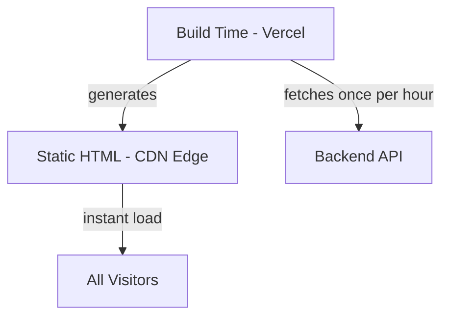

<div align="center">

# 🚀 Personal Portfolio

### A blazing-fast, visually stunning portfolio with ISR-powered static architecture

[](https://nextjs.org/)
[](https://react.dev/)
[](https://typescriptlang.org/)
[](https://tailwindcss.com/)
[](https://mongodb.com/)
[](LICENSE)

<br />

**[🌐 Live Demo](http://dipakkhandagale.vercel.app/)** · **[📖 Documentation](#-getting-started)** · **[🐛 Report Bug](https://github.com/Dipakk7/Portfolio/issues)**

</div>

---

## 📸 Preview

<div align="center">

<!-- Replace with real screenshots. Recruiters skim a README before they clone — this is the single highest-impact section. -->


*WebGL mosaic shader hero with real-time theme switching*

</div>

<details>
<summary><b>📷 More screenshots</b> (Projects · Admin Dashboard · Mobile view)</summary>

<br />


</details>

---

## 📑 Table of Contents

- [Performance First](#-performance-first)
- [Features](#-features)
- [Admin Content Management](#-admin-content-management)
- [Tech Stack](#️-tech-stack)
- [Getting Started](#-getting-started)
- [Deployment](#-deployment)
- [Project Structure](#-project-structure)
- [ISR Data Flow](#-isr-data-flow)
- [Roadmap](#-roadmap)
- [License](#-license)
- [Contact](#-contact)

---

## ⚡ Performance First

<table>
<tr>
<td width="50%">

### 🏎️ Static-First Architecture

Built with **Incremental Static Regeneration (ISR)**, the site loads **instantly** from Vercel's CDN. Backend cold starts? They don't affect your visitors.

| Metric | Value |
|--------|-------|
| First Contentful Paint | < 1s |
| Time to Interactive | < 2s |
| Runtime API Calls | **0** |

</td>
<td width="50%">

### 🔄 How It Works



</td>
</tr>
</table>

---

## ✨ Features

<table>
<tr>
<td width="33%" valign="top">

### 🎨 Creative UI/UX
- **WebGL Mosaic Shaders** - Stunning pixelated wave hero animations
- **Framer Motion** - Buttery smooth transitions
- **Limelight Navigation** - Interactive spotlight nav bar
- **Custom Cursor** - Unique browsing experience
- **Dark/Light Mode** - System-aware theming

</td>
<td width="33%" valign="top">

### 🛡️ Security
- **Hidden Backend** - API proxied via Next.js
- **XSS Protected** - Sanitized inputs
- **Rate Limited** - Abuse prevention
- **Zod Validation** - Type-safe schemas
- **Helmet Headers** - Security-first

</td>
<td width="33%" valign="top">

### 📊 Admin Dashboard
- **Home Content** - Hero, About, Skills, Footer
- **Projects** - CRUD with image uploads
- **Blogs** - Rich content management
- **Certificates** - Showcase credentials
- **Experience** - Timeline management
- **Messages** - Contact form inbox

</td>
</tr>
</table>

---

## 📝 Admin Content Management

All content is managed through the admin dashboard and reflected on the site via ISR:

| Admin Section | Controls |
|---------------|----------|
| **Home Content** | Hero title/subtitle, About section, Skills, Social links, Footer |
| **Experience** | Work history timeline with roles, companies, descriptions |
| **Projects** | Portfolio projects with images, GitHub links, tech tags |
| **Blogs** | Blog posts with rich content and tags |
| **Certificates** | Professional certifications with images |
| **Skills** | Technology icons displayed in staggered grid |

---

## 🛠️ Tech Stack

<table>
<tr>
<td align="center" width="96">

<br>Next.js 15
</td>
<td align="center" width="96">

<br>React 18
</td>
<td align="center" width="96">

<br>TypeScript
</td>
<td align="center" width="96">

<br>Tailwind
</td>
<td align="center" width="96">

<br>Node.js
</td>
<td align="center" width="96">

<br>Express
</td>
<td align="center" width="96">

<br>MongoDB
</td>
<td align="center" width="96">

<br>Vercel
</td>
</tr>
</table>

---

## 🚀 Getting Started

### Prerequisites

- Node.js 18+
- MongoDB Atlas account
- Cloudinary account (for media)

### Installation

```bash
# Clone the repository
git clone https://github.com/Dipakk7/Portfolio.git
cd Portfolio

# Install all dependencies
npm install          # Root package.json
cd client && npm install
cd ../server && npm install
```

### Environment Setup

<details>
<summary><b>📁 Client Environment</b> (<code>client/.env.local</code>)</summary>

```env
# Server-side only (for ISR data fetching)
API_URL=http://localhost:5000

# Optional: On-demand revalidation
REVALIDATE_SECRET=your-super-secret-key
```

</details>

<details>
<summary><b>📁 Server Environment</b> (<code>server/.env</code>)</summary>

```env
PORT=5000
NODE_ENV=development

# Database
MONGODB_URI=mongodb+srv://...

# Authentication
JWT_SECRET=your-jwt-secret

# Cloudinary
CLOUDINARY_CLOUD_NAME=your-cloud
CLOUDINARY_API_KEY=your-key
CLOUDINARY_API_SECRET=your-secret
```

</details>

### Run Locally

```bash
# Terminal 1 - Start Backend
cd server
npm run dev
# → http://localhost:5000

# Terminal 2 - Start Frontend  
cd client
npm run dev
# → http://localhost:3000
```

---

## 🌐 Deployment

### Frontend (Vercel)

1. Import `client` folder to Vercel
2. Set environment variables:
   ```
   API_URL = https://your-backend.onrender.com
   REVALIDATE_SECRET = <your-secret>
   ```
3. Deploy! 🚀

### Backend (Render)

1. Create new Web Service from `server` folder
2. Set all backend environment variables
3. Deploy! 🚀

### On-Demand Revalidation

After updating content in admin, trigger instant cache refresh:

```bash
curl "https://your-site.vercel.app/api/revalidate?secret=YOUR_SECRET"
```

Or add a "Publish Changes" button in the admin dashboard.

---

## 📁 Project Structure

```
Portfolio/
├── client/                 # Next.js Frontend
│   ├── app/               # App Router pages
│   │   ├── admin/        # Admin dashboard
│   │   ├── blog/         # Blog pages
│   │   └── api/          # API routes (revalidation)
│   ├── components/        # React components
│   ├── lib/
│   │   └── data.ts       # ISR data fetching layer
│   └── public/           # Static assets
│
├── server/                # Express Backend
│   ├── src/
│   │   ├── controllers/  # Route handlers
│   │   ├── models/       # Mongoose schemas
│   │   ├── router/       # API routes
│   │   └── middleware/   # Auth, validation, etc.
│   └── scripts/
│       └── create_admin.js  # Admin user creation
│
└── README.md
```

---

## 🔄 ISR Data Flow

All public pages are **statically generated** at build time:

```mermaid
flowchart LR
    A[Admin Updates Content] --> B[Backend API]
    B --> C{Revalidation Trigger}
    C -->|Automatic| D[Every 1 Hour]
    C -->|Manual| E[/api/revalidate]
    D --> F[Regenerate Static Pages]
    E --> F
    F --> G[CDN Serves Fresh Content]
```

### Components Using ISR Data

| Component | Data Source |
|-----------|-------------|
| `ShaderAnimation` | `heroTitle`, `heroSubtitle` |
| `About` | `aboutTitle`, `aboutSubtitle`, `aboutDescription` |
| `BentoGrid` (Skills) | `skills[]` |
| `Experience` | `experiences[]` |
| `GithubProjects` | `projects[]` |
| `BlogsPapers` | `blogs[]` |
| `Certificates` | `certificates[]` |
| `Footer` | `email`, `socialLinks`, `footerText` |

---

## 🗺️ Roadmap

- [ ] Automated tests (Jest / Playwright)
- [ ] CI pipeline (GitHub Actions) for lint + build checks on PRs
- [ ] Analytics dashboard for admin
- [ ] Blog post view counters + reactions

---

## 📜 License

This project is licensed under the **MIT License** - see the [LICENSE](LICENSE) file for details.

---

## 📬 Contact

<div align="center">

**Dipak Khandagale** — AI/ML Engineer

[](https://dipakkhandagale.vercel.app/)
[](https://github.com/Dipakk7)
<!-- Add LinkedIn / Email badges here -->

<br />

**Built with ❤️ and ☕ by [Dipak Khandagale](https://github.com/Dipakk7)**

⭐ Star this repo if you find it useful!

</div>
